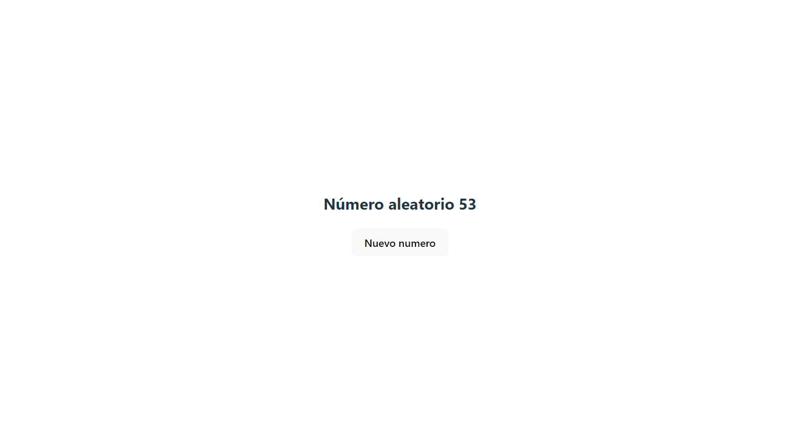
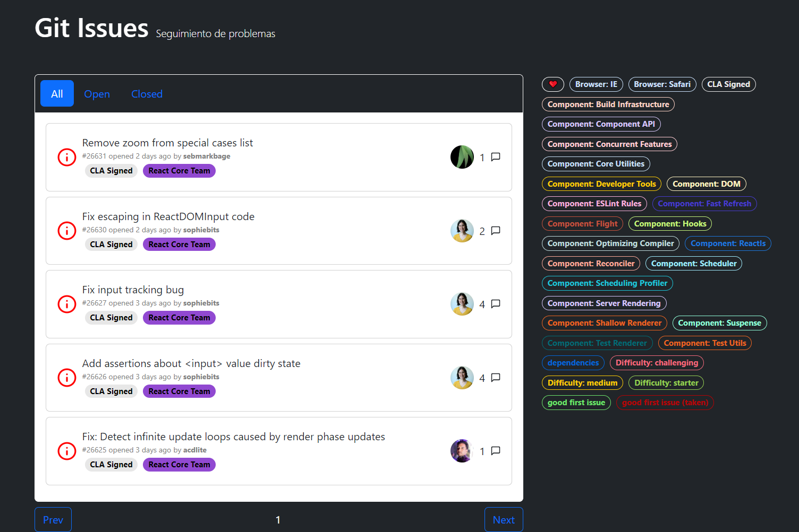

# curso-react-query


Practicas realizadas en el curso de Fernando Herrera en la plataforma [DevTalles](https://cursos.devtalles.com/courses/take/react-query)

Puedes ver una review del curso en [La Codeteca]()
 
## cripto-random

Practica para mostrar números aleatorios empleando la API [random.org](www.random.org)



**Features**
- React-query
- Gestión de caché y re-lanzado de peticiones usando react-query

---

## react-query-issues

Practica para visualizar los issues de un repositorio de github usando react-query.



**Features**

- Realizar peticiones a la API de github usando Axios (con y sin autenticar)
- Filtros usando react-query + Axios
- Gestión de cache con react-query
- Paginación
- Infinite scrol

---

# Lanzar el proyecto

1. Clonar el repositorio
```
git clone git@github.com:crakernano/curso-react-query.git
```

2. Entrar dentro de la carpeta del proyecto que se desea lanzar
```
cd cripto-random 
```
            o 
```
cd react-query-issues
```

3. Instalar las dependencias
```
npm install
```

4. Lanzar el entorno de desarrollo
```
npm run dev
```